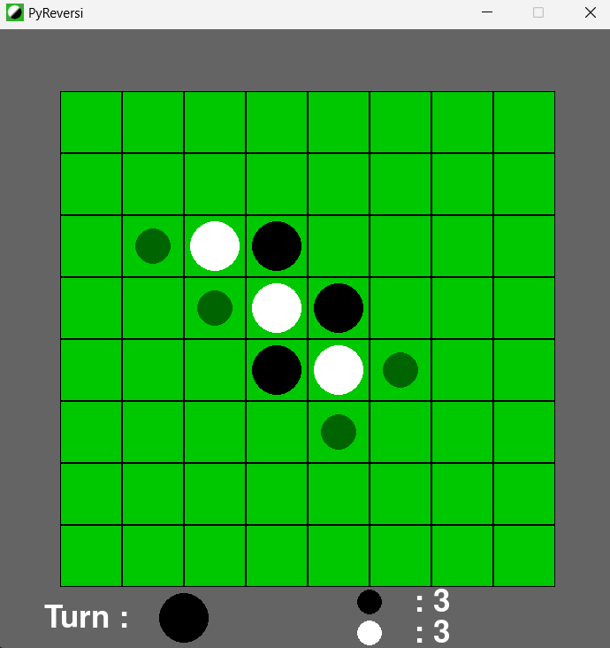
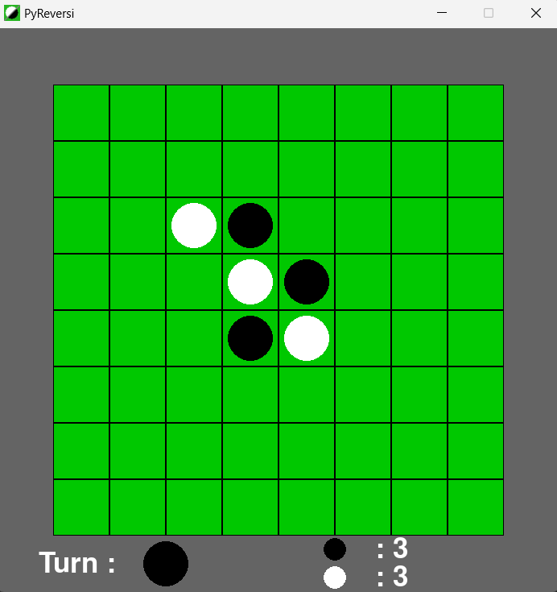
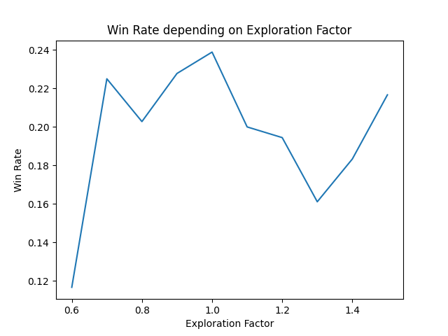
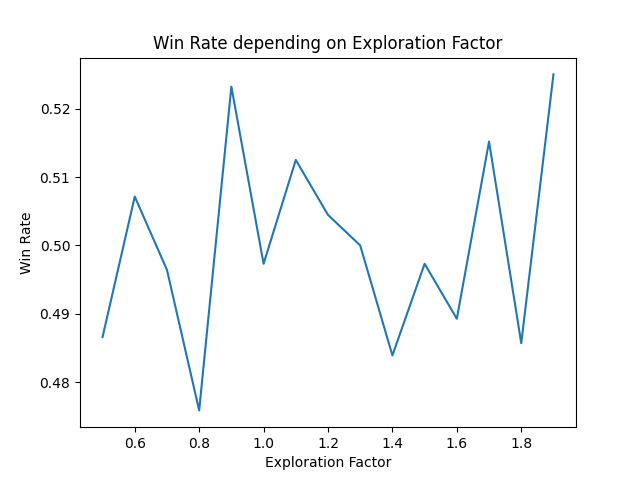

# PyReversi 
## Introduction
The goal of this project was to develop an AI playing Reversi, with a correct level.
I started from scratch by coding the Reversi app, which can be played by two human players, one human player against the AI, or two AIs.

## Installation
Clone the repository and install the required modules :

    git clone git@github.com:Lord-Eler/PyReversi.git
    cd PyReversi
    pip install -r requirements.txt

## How to use it
Enter :

    python main.py
Then select the options you want for the game

You can play with or without available moves visibility

## How it works
After some research, I decided to use the Monte-Carlo Tree Search (MCTS) algorithm, since it is used mainly for two players games with perfect information and a high branching factor, which is the case of Reversi.
More explanations on MCTS can be found [here](https://en.wikipedia.org/wiki/Monte_Carlo_tree_search).

Aside of the number of iterations of MCTS per move (which is just a compromise between skill and computation time), there is one parameter to tweak to optimize MCTS : the exploration factor. This constant tells the algorithm to favor moves that are known to be good (exploitation), or to favor the analysis of moves that are rather unknown (exploration).  
To find a good exploration factor, I set up a tournament with multiple versions of my AI, each having a different exploration factor. The range for the factors was [0.6,1.5] since I found online that a good factor is 0.7 for Reversi, and the theoretical value is sqrt(2) = 1.41.

I got this graph :

So the best exploration factor may be 1 according to this graph.
However, this result may not be significant since there were less games played than planned (354 instead of 900).

I then made other attempts to get graphs.  
Another attempt for exploration factors in [0.5,1.9] gave this graph :

The graphs I made confirm that I can't extract a relevant value from this method, because the behavior of the win rate is too random, althought values slightly greater than 0.6 and values slightly smaller than 1 seem to be more efficient.

I chose to set the default exploration factor to 0.7, since it gives very correct results.